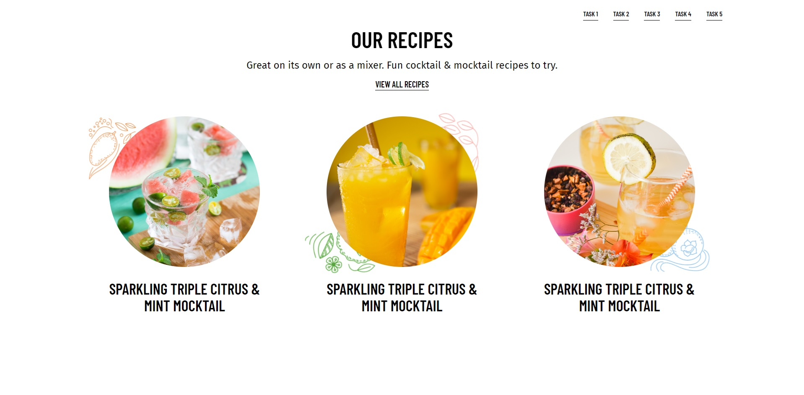

# Local Development Tasks Documentation

## About project

This project is a collection of 5 unrelated frontend tasks listed bellow:

1. TASK - Image + Text section
2. TASK - Blog Showcase section
3. TASK - Simple swiper section
4. TASK - Shopify scheme
5. TASK - Bonus task (favorite project)

You can run the project locally, or you can test it on the live version available at [dev.volimfilm.com](http://dev.volimfilm.com/)

## Screenshots

  

  

  

  

  

## Environment

- Node v21.6.2

## Stack

    
    
    

## Running a project

- To run the project locally, ensure you have NodeJS version 21.6.2 installed. While the code may work with other versions, it is recommended to use NodeJS v21.6.2 for optimal compatibility.
- Navigate to the root folder of the project.
- Run the `yarn install` command to install all the required packages.
- After the packages have been installed run the `yarn sass` command to bundle scss files from the `assets/styles` to `dist/css` folder 
- Start the live server from your prefered code editor and the project should be up and running

## Project structure

### Root files and folders
  - `assets` - contains all `js scripts` and `styles` used in the folder
  - `dist` - contains all static files used in the project (`images` and `css` bundles )
  - `.html` files - there are five HTML files for each of the five tasks
  - `task-4.liquid` - liquid file that hold the shopify schema for the section in the first task

### Tasks structure
- Each tasks has it's own HTML file (`index.html` for the first task)
- Each task has it's own root style file within the `assets/styles/tasks` folder (`assets/styles/tasks/task-[task_number]/task-[task_number].scss`)
- Each task has it's own root js file (if it was necessary) within the `assets/js/tasks` folder (`assets/js/tasks/task-[task_number]/[feature-name].js`),
  - Additionaly, in the `assets/js/helpers` folder are components used in the first task